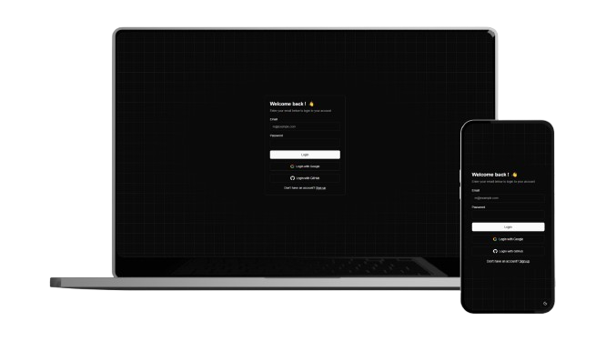

## Next.js Authentication App (Next Auth v5) with Prisma and NeonDB

This project is an authentication app built using Next.js (v5) and Prisma ORM, connected to a NeonDB PostgreSQL database. The app is designed with a focus on secure authentication, efficient state management, and integration with modern tools like Prisma and NeonDB for seamless data handling.

> [!Warning]
> This project is under development. Use development build until deployment.

## Getting Started

Follow the instructions below to set up and run the project locally.

### Prerequisites

Make sure you have Node.js version 18.17 or later installed on your system.

### Installation

1. **Clone the respository:**

```bash
git clone https://github.com/Chippos/NextAuth-V5.git
```

2. **Install the dependencies:**

```bash
npm install
```

3. **Run the project:**

```bash
npm run dev
```

This will install the required dependencies and run the development build in your local environment. You can open the app in your browser on the specified port.

## Screenshots



## Key Features

- **Next.js v5**: Utilizes the latest version of Next.js for server-side rendering, dynamic routing, and API routes.
- **Prisma ORM**: Simplified database management and schema migrations using Prisma ORM.
- **NeonDB**: Integrated with NeonDB, a scalable and reliable PostgreSQL cloud database.
- **NextAuth.js**: Secure authentication and session management with NextAuth.js, supporting multiple providers.
- **Tanstack Query**: Efficient server-state management and data synchronization for a smoother user experience.
- **Typescript**: Ensures strong typing across the codebase for improved developer experience and error prevention.
